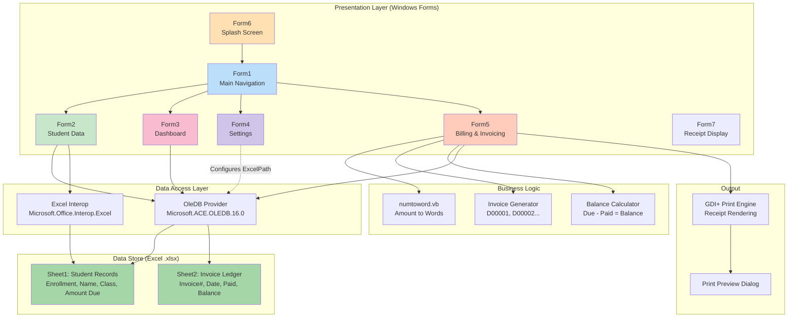
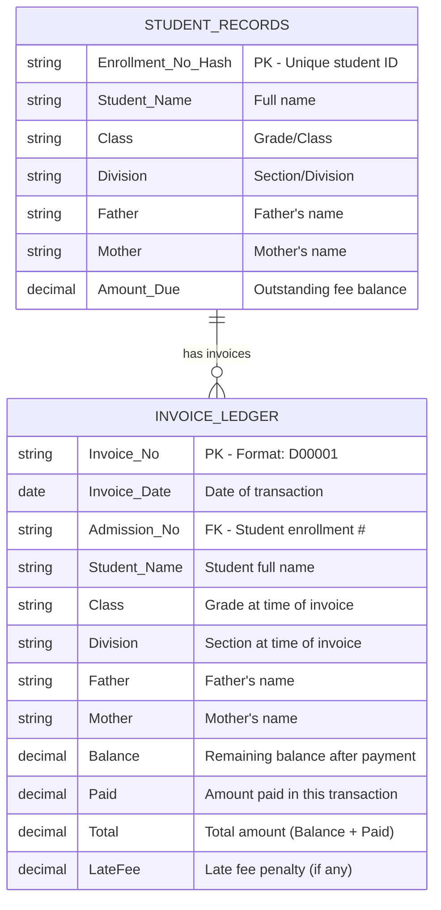
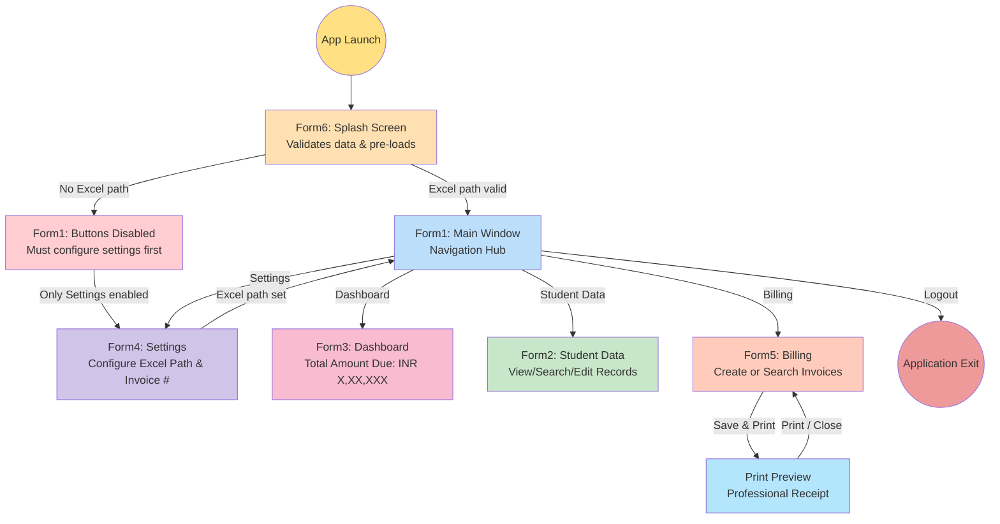
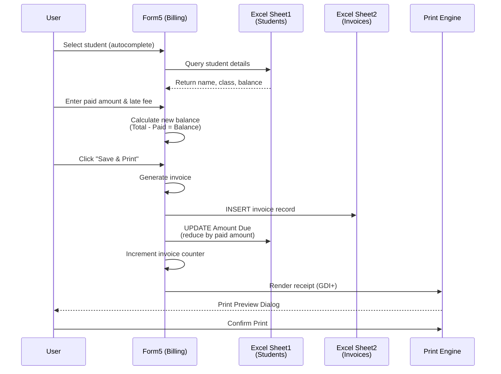
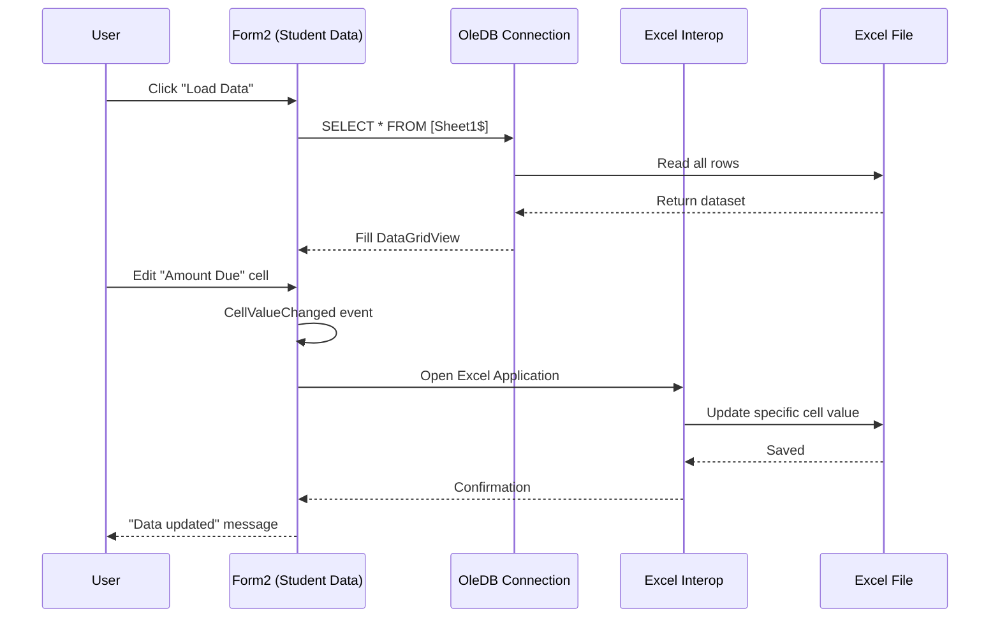
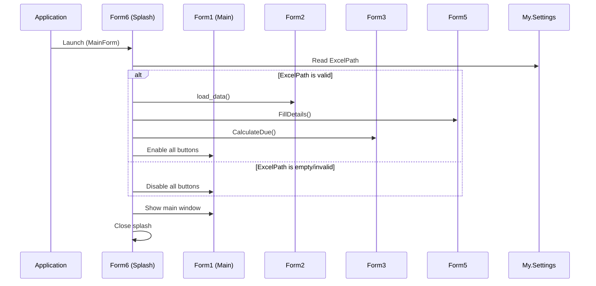
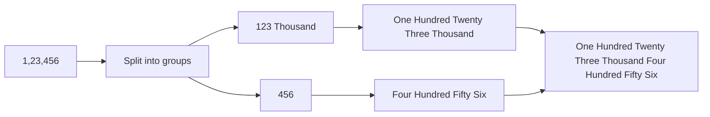

<p align="center">
  
  
  
  
  
  
</p>

<h1 align="center">BillDesk. - Billing System</h1>

<p align="center">
  <strong>A desktop billing and fee management application for educational institutions</strong><br>
  Built with VB.NET &bull; Windows Forms &bull; Excel as Database
</p>

<p align="center">
  <em>Designed for Gayathri Central School &mdash; Streamlining student fee collection, invoice generation, and receipt printing</em>
</p>

---

## Table of Contents

- [Overview](#-overview)
- [Key Features](#-key-features)
- [Tech Stack](#-tech-stack)
- [Project Structure](#-project-structure)
- [Application Architecture](#-application-architecture)
- [Database Schema](#-database-schema)
- [Screen Guide](#-screen-guide--form-descriptions)
- [Navigation Flow](#-navigation-flow)
- [Data Flow Diagrams](#-data-flow-diagrams)
- [Invoice & Receipt System](#-invoice--receipt-system)
- [Utility Modules](#-utility-modules)
- [Configuration](#%EF%B8%8F-configuration)
- [Setup & Installation](#-setup--installation)
- [Publisher Info](#-publisher-info)

---

## Overview

**BillDesk.** is a Windows desktop application built to manage student fee billing for schools. It replaces manual fee registers with a digital solution that:

- Stores student enrollment data in Excel spreadsheets
- Tracks fee dues and payments per student
- Generates sequential invoices with unique IDs
- Prints professional receipts with school branding
- Provides a dashboard showing total outstanding dues

The application follows a **form-based architecture** where each screen (Form) handles a specific module. Data is stored in Excel files accessed via OleDB, making it lightweight and easy to deploy without a database server.

---

## Key Features

| Feature | Description |
|:--------|:------------|
| **Student Data Management** | View, search, and edit student enrollment records with real-time filtering |
| **Fee Billing** | Create invoices, record payments, and auto-calculate remaining balances |
| **Invoice Generation** | Auto-incrementing invoice numbers (format: `D00001`, `D00002`, ...) |
| **Receipt Printing** | Professional GDI+ rendered receipts with school header, fee table, and totals in words |
| **Dashboard** | At-a-glance total outstanding dues across all students |
| **Late Fee Support** | Optional late fee charges on overdue payments |
| **Excel Integration** | Uses Excel as a lightweight database — no server setup required |
| **Autocomplete Search** | Smart search across student names, enrollment numbers, and invoice IDs |
| **Settings Panel** | Configure data source path and manage invoice numbering |
| **Amount in Words** | Converts numeric amounts to English words on receipts (e.g., "One Thousand Five Hundred Rupees Only") |

---

## Tech Stack

```
+---------------------------------------------------------------------+
|                        BillDesk. Tech Stack                         |
+---------------------------------------------------------------------+
|                                                                     |
|  +-------------------+    +-------------------+    +--------------+ |
|  |    LANGUAGE        |    |    FRAMEWORK      |    |   UI LAYER   | |
|  |  Visual Basic .NET |    |  .NET Framework   |    | Windows Forms| |
|  |    (VB.NET)        |    |      3.5 SP1      |    | (WinForms)   | |
|  +-------------------+    +-------------------+    +--------------+ |
|                                                                     |
|  +-------------------+    +-------------------+    +--------------+ |
|  |   DATA ACCESS      |    |    DATABASE       |    |   PRINTING   | |
|  |  OleDB Provider    |    |  Microsoft Excel  |    |  GDI+ Custom | |
|  | (ACE.OLEDB.16.0)   |    |  (.xlsx files)    |    |  Graphics    | |
|  +-------------------+    +-------------------+    +--------------+ |
|                                                                     |
|  +-------------------+    +-------------------+    +--------------+ |
|  |   EXCEL INTEROP    |    |   BUILD SYSTEM    |    |  DEPLOYMENT  | |
|  | Microsoft.Office   |    |     MSBuild       |    |  ClickOnce   | |
|  | .Interop.Excel     |    |                   |    |              | |
|  +-------------------+    +-------------------+    +--------------+ |
|                                                                     |
+---------------------------------------------------------------------+
```

| Layer | Technology | Purpose |
|:------|:-----------|:--------|
| **Language** | VB.NET | Application logic and event handling |
| **UI Framework** | Windows Forms | Desktop GUI with forms, buttons, grids |
| **Runtime** | .NET Framework 3.5 SP1 | Core runtime and libraries |
| **Data Access** | OleDB (Microsoft.ACE.OLEDB.16.0) | SQL-like queries against Excel files |
| **Data Store** | Microsoft Excel (.xlsx) | Stores student records and invoices |
| **Excel Interop** | Microsoft.Office.Interop.Excel | Direct cell-level updates to Excel |
| **Printing** | System.Drawing (GDI+) | Custom-rendered receipt printing |
| **Number Conversion** | Custom `numtoword` class | Converts amounts to English words |
| **Build** | MSBuild | Compilation and packaging |
| **Deployment** | ClickOnce | Windows installer distribution |

---

## Project Structure

```
BillDesk.-Billing-System/
|
+-- Fees_Management_1/                    # Primary project
|   +-- Fees_Management.sln              # Visual Studio Solution file
|   |
|   +-- Fees_Management/                 # Main application source
|   |   +-- Form1.vb                     # Main window & navigation hub
|   |   +-- Form1.Designer.vb            # Form1 UI layout (auto-generated)
|   |   +-- Form1.resx                   # Form1 embedded resources
|   |   |
|   |   +-- Form2.vb                     # Student data management
|   |   +-- Form2.Designer.vb            # Form2 UI layout
|   |   +-- Form2.resx                   # Form2 resources
|   |   |
|   |   +-- Form3.vb                     # Dashboard (total dues)
|   |   +-- Form3.Designer.vb            # Form3 UI layout
|   |   +-- Form3.resx                   # Form3 resources
|   |   |
|   |   +-- Form4.vb                     # Settings & configuration
|   |   +-- Form4.Designer.vb            # Form4 UI layout
|   |   +-- Form4.resx                   # Form4 resources
|   |   |
|   |   +-- Form5.vb                     # Billing & invoice generation
|   |   +-- Form5.Designer.vb            # Form5 UI layout
|   |   +-- Form5.resx                   # Form5 resources
|   |   |
|   |   +-- Form6.vb                     # Splash/startup loader
|   |   +-- Form6.Designer.vb            # Form6 UI layout
|   |   +-- Form6.resx                   # Form6 resources
|   |   |
|   |   +-- Form7.vb                     # Receipt display (legacy)
|   |   +-- Form7.Designer.vb            # Form7 UI layout
|   |   +-- Form7.resx                   # Form7 resources
|   |   |
|   |   +-- numtoword.vb                 # Number-to-words utility class
|   |   +-- UserControl1.vb              # Empty user control (unused)
|   |   +-- ApplicationEvents.vb         # Application lifecycle events
|   |   |
|   |   +-- app.config                   # Application settings (ExcelPath, invoice#)
|   |   +-- Fees_Management.vbproj       # MSBuild project file
|   |   |
|   |   +-- My Project/                  # VB.NET project metadata
|   |   |   +-- Application.myapp        # App startup config (MainForm: Form6)
|   |   |   +-- AssemblyInfo.vb          # Assembly metadata & versioning
|   |   |   +-- Resources.resx           # Global embedded resources (icons, images)
|   |   |   +-- Settings.settings        # Typed settings definitions
|   |   |   +-- Settings.Designer.vb     # Auto-generated settings accessor
|   |   |   +-- Resources.Designer.vb    # Auto-generated resource accessor
|   |   |
|   |   +-- bin/Debug/                   # Compiled output (executable + DLLs)
|   |
|   +-- Billing System User Files/       # Sample data files
|   |   +-- data.xlsx                    # Sample student/billing data
|   |   +-- sample.pdf                   # Sample receipt outputs
|   |   +-- sample2.pdf
|   |   +-- updated.pdf
|   |
|   +-- WapProjTemplate1/               # Windows App Packaging (UWP wrapper)
|
+-- Fees_Management_2/                   # Duplicate copy of the project
|
+-- README.md                            # This file
```

---

## Application Architecture

### High-Level Architecture



### Component Interaction Model

```
+------------------+         +------------------+         +------------------+
|   PRESENTATION   |         |  BUSINESS LOGIC  |         |   DATA ACCESS    |
|                  |         |                  |         |                  |
| Form1 (Nav)      |-------->| Balance Calc     |-------->| OleDB Connection |
| Form2 (Students) |         | Invoice Gen      |         | Excel Interop    |
| Form3 (Dashboard)|         | numtoword        |         |                  |
| Form4 (Settings) |         | Search/Filter    |         |  +------------+  |
| Form5 (Billing)  |         |                  |         |  | Excel File |  |
| Form6 (Splash)   |         |                  |         |  | Sheet1     |  |
| Form7 (Receipt)  |         |                  |         |  | Sheet2     |  |
+------------------+         +------------------+         +------------------+
        |                                                          |
        |                    +------------------+                  |
        +------------------->|     OUTPUT       |<-----------------+
                             |  GDI+ Printing   |
                             |  Print Preview   |
                             +------------------+
```

---

## Database Schema

The application uses an **Excel workbook** as its database with two sheets:

### Entity Relationship Diagram



### Sheet1: Student Records (Master Data)

| Column | Type | Description | Editable |
|:-------|:-----|:------------|:---------|
| `Enrollment No#` | String | Primary key - unique student identifier | No |
| `Student Name` | String | Full name of the student | No |
| `Class` | String | Grade/class (e.g., "10th", "12th") | No |
| `Division` | String | Section (e.g., "A", "B", "C") | No |
| `Father` | String | Father's name | No |
| `Mother` | String | Mother's name | No |
| `Amount Due` | Decimal | Outstanding fee balance (in INR) | **Yes** |

### Sheet2: Invoice Ledger (Transaction History)

| Column | Type | Description |
|:-------|:-----|:------------|
| `Invoice_No` | String | Unique invoice ID (format: `D00001`) |
| `Invoice_Date` | Date | Date the invoice was created |
| `Admission_No` | String | Links to student's Enrollment No# |
| `Student_Name` | String | Snapshot of student name at transaction time |
| `Class` | String | Snapshot of class |
| `Division` | String | Snapshot of division |
| `Father` | String | Snapshot of father's name |
| `Mother` | String | Snapshot of mother's name |
| `Balance` | Decimal | Remaining balance after this payment |
| `Paid` | Decimal | Amount paid in this transaction |
| `Total` | Decimal | Total amount = Balance + Paid |
| `LateFee` | Decimal | Late fee penalty applied |

> **Note:** Sheet2 is an **append-only ledger** - records are only inserted, never updated or deleted. This preserves a complete transaction history.

---

## Screen Guide & Form Descriptions

### Form6 - Splash Screen (Startup)

```
+---------------------------------------+
|                                       |
|          Loading BillDesk...          |
|                                       |
|   [Validating Excel connection...]    |
|   [Pre-loading student data...]       |
|   [Initializing invoice system...]    |
|                                       |
+---------------------------------------+
```

**File:** `Form6.vb` (35 lines)
**Role:** Application entry point. Runs on startup before the main window appears.

**What it does:**
1. Validates the configured Excel file path
2. Pre-loads student data into Form2's DataGridView
3. Pre-loads autocomplete suggestions for Form5
4. Calculates dashboard totals for Form3
5. Disables navigation buttons if Excel path is invalid
6. Transitions to Form1 (main window)

---

### Form1 - Main Navigation Hub

```
+----------------------------------------------------------+
|  BillDesk.                                               |
+----------+-----------------------------------------------+
|          |                                               |
|  [Logo]  |                                               |
|          |                                               |
| +------+ |          (Content Area)                       |
| | Dash | |                                               |
| +------+ |    Displays Form2, Form3, Form4, or Form5    |
| +------+ |    based on which sidebar button is clicked   |
| | Stud | |                                               |
| +------+ |                                               |
| +------+ |                                               |
| | Bill | |                                               |
| +------+ |                                               |
| +------+ |                                               |
| | Sett | |                                               |
| +------+ |                                               |
|          |                                               |
| Welcome  |                                               |
| User,    |                                               |
| [Logout] |                                               |
+----------+-----------------------------------------------+
```

**File:** `Form1.vb` (103 lines)
**Role:** Master container window with sidebar navigation.

**Navigation Buttons:**
| Button | Icon | Target | Action |
|:-------|:-----|:-------|:-------|
| Button1 | Dashboard icon | Form3 | Shows financial summary |
| Button2 | Student icon | Form2 | Opens student data manager |
| Button4 | Billing icon | Form5 | Opens invoice generator |
| Button3 | Settings icon | Form4 | Opens configuration panel |

**Behavior:**
- Only one child form is visible at a time
- Child forms are positioned relative to Form1 at offset `(Left + 240, Top + 50)`
- All buttons are disabled until a valid Excel path is configured
- Logout closes the application

---

### Form2 - Student Data Management

```
+----------------------------------------------------------+
|  Student Data                                            |
+----------------------------------------------------------+
|                                                          |
|  Search by Name: [_______________]                       |
|  Search by Enrollment: [_______________]   [Load Data]   |
|                                                          |
|  +------+---------------+-------+-----+--------+------+ |
|  | Enr# | Student Name  | Class | Div | Father | Due  | |
|  +------+---------------+-------+-----+--------+------+ |
|  | 1001 | John Smith    | 10th  |  A  | Robert | 5000 | |
|  | 1002 | Jane Doe      | 10th  |  B  | Mark   | 3500 | |
|  | 1003 | Alex Johnson  | 11th  |  A  | David  | 0    | |
|  | ...  | ...           | ...   | ... | ...    | ...  | |
|  +------+---------------+-------+-----+--------+------+ |
|                                                          |
+----------------------------------------------------------+
```

**File:** `Form2.vb` (176 lines)
**Role:** View and manage student enrollment records.

**Key Functions:**

| Function | Description |
|:---------|:------------|
| `load_data()` | Loads all student records from Excel Sheet1 into the DataGridView |
| `TextBox1_TextChanged()` | Real-time search filter by student name (SQL LIKE) |
| `TextBox2_TextChanged()` | Real-time search filter by enrollment number |
| `DataGridView1_CellValueChanged()` | Detects edits to the "Amount Due" column and saves to Excel |
| `SaveData()` | Updates Excel file directly via Excel Interop when a cell value changes |

**Features:**
- Columns 0-5 are **read-only** (enrollment data)
- Column 6 (Amount Due) is **editable** directly in the grid
- Real-time filtering as you type in search boxes
- Changes auto-save to Excel file immediately

---

### Form3 - Dashboard

```
+----------------------------------------------------------+
|  Dashboard                                               |
+----------------------------------------------------------+
|                                                          |
|                                                          |
|              Total Amount Due                            |
|                                                          |
|                 +------------------+                     |
|                 |                  |                     |
|                 |   INR 1,25,000   |                     |
|                 |                  |                     |
|                 +------------------+                     |
|                                                          |
|                                                          |
+----------------------------------------------------------+
```

**File:** `Form3.vb` (37 lines)
**Role:** Financial summary dashboard.

**Key Function:**

| Function | Description |
|:---------|:------------|
| `CalculateDue()` | Queries Sheet1, sums all `[Amount Due]` values, displays the total |

This is the simplest form - it reads all student records, sums the outstanding fees, and displays the total in a large, prominent label.

---

### Form4 - Settings

```
+----------------------------------------------------------+
|  Settings                                                |
+----------------------------------------------------------+
|                                                          |
|  +----------------------------------------------------+ |
|  |  Data Configuration                                | |
|  |                                                    | |
|  |  Excel File Path:                                  | |
|  |  [C:\Users\...\data.xlsx         ] [Browse]        | |
|  |                                                    | |
|  |  Latest Invoice Number:                            | |
|  |  [00042                           ] [Save]         | |
|  |                                                    | |
|  |                              [Clear All]           | |
|  +----------------------------------------------------+ |
|                                                          |
+----------------------------------------------------------+
```

**File:** `Form4.vb` (92 lines)
**Role:** Application configuration management.

**Settings Managed:**

| Setting | Storage Key | Description | Default |
|:--------|:-----------|:------------|:--------|
| Excel File Path | `ExcelPath` | Path to the `.xlsx` data file | `""` (empty) |
| Invoice Number | `invoice_latest` | Current invoice sequence counter | `"00001"` |

**Functions:**
| Function | Description |
|:---------|:------------|
| `Button1_Click()` | Opens file browser to select `.xls`/`.xlsx`/`.xlsm` file |
| `Button2_Click()` | Clears Excel path, resets invoice counter to `00001`, disables navigation |
| `Button3_Click()` | Saves the manually edited invoice number |
| `reload_inv()` | Loads the latest invoice number from settings into the textbox |

---

### Form5 - Billing & Invoice Generation (Core Module)

```
+----------------------------------------------------------+
|  Billing                                                 |
+----------------------------------------------------------+
|                                                          |
|  [ ] Search Existing Invoice    [ ] Add Late Fee         |
|                                                          |
|  Invoice #:  [D00042        ]   Date: [02/04/2026]       |
|                                                          |
|  Admission #: [1001         ]   Student: [John Smith   ] |
|  Class:       [10th         ]   Division: [A           ] |
|  Father:      [Robert Smith ]   Mother:  [Mary Smith   ] |
|                                                          |
|  +----------------------------------------------------+  |
|  | Total Due     |  Paid Amount  |  Late Fee | Balance |  |
|  |    5,000      |   [2,000    ] |   [0    ] |  3,000  |  |
|  +----------------------------------------------------+  |
|                                                          |
|  [Clear]              [Save]              [Save & Print]  |
|                                                          |
+----------------------------------------------------------+
```

**File:** `Form5.vb` (655 lines) - **Largest and most complex form**
**Role:** Invoice creation, payment processing, and receipt generation.

**Two Operating Modes:**

| Mode | Trigger | Description |
|:-----|:--------|:------------|
| **New Invoice** | CheckBox1 = unchecked | Create a new payment record |
| **Search Invoice** | CheckBox1 = checked | Look up and reprint past invoices |

**Key Functions:**

| Function | Description |
|:---------|:------------|
| `generate_Invoice()` | Returns next invoice ID: `"D" + My.Settings("invoice_latest")` |
| `FillDetails()` | Loads student autocomplete data from Sheet1 |
| `FillSearchDetails()` | Loads invoice autocomplete data from Sheet2 |
| `SaveExcel()` | Inserts invoice into Sheet2, updates student balance in Sheet1, increments counter |
| `UpdateData()` | Updates a student's `Amount Due` in Sheet1 (parameterized query) |
| `return_length()` | Checks if an invoice number already exists (prevents duplicates) |
| `PrintDocument1_PrintPage()` | Custom GDI+ receipt rendering |
| `TextBox8_TextChanged()` | Auto-calculates: `Balance = Total - Paid` (validates no negative balances) |

**Autocomplete Format:**
- Students: `AdmissionNo-Name-Class-Division-Father-Mother-Balance`
- Invoices: `InvoiceNo$Date$AdmNo$Name$Class$Div$Father$Mother$Balance$Paid$LateFee`

---

### Form7 - Receipt Display (Legacy)

**File:** `Form7.vb` (56 lines)
**Role:** Alternative receipt display using labels (superseded by Form5's GDI+ printing).

---

## Navigation Flow



---

## Data Flow Diagrams

### Payment Processing Flow



### Student Data Edit Flow



### Application Startup Flow



---

## Invoice & Receipt System

### Invoice Number Format

```
  D 0 0 0 4 2
  | |       |
  | +-------+---- 5-digit zero-padded sequence number
  |
  +-------------- Prefix "D" (constant)

  Examples: D00001, D00002, ..., D99999

  Storage: My.Settings("invoice_latest") = "00042"
  Generated: "D" + "00042" = "D00042"
  After save: counter increments to "00043"
```

### Receipt Layout

The application generates professional receipts using custom GDI+ graphics rendering. The receipt includes:

```
+----------------------------------------------------------+
|                                                          |
|  [School Logo]   GAYATHRI CENTRAL SCHOOL                 |
|                  Pampady P.O, Kottayam                   |
|                  Phone: 0481 2509550                     |
|                  www.gayathricentralschool.com            |
|                                                          |
+----------------------------------------------------------+
|  FEE RECEIPT                                             |
|                                                          |
|  Receipt No: D00042          Date: 02/04/2026            |
|  Student: John Smith         Admission No: 1001          |
|  Class: 10th                 Division: A                 |
|  Father: Robert Smith        Mother: Mary Smith          |
|                                                          |
+----------------------------------------------------------+
|                                                          |
|  +----+------------------+-----------+                   |
|  | #  | Description      | Amount    |                   |
|  +----+------------------+-----------+                   |
|  | 1  | School Fee       | 5,000.00  |                   |
|  | 2  | Late Fee         |     0.00  |                   |
|  +----+------------------+-----------+                   |
|  |    | Total Paid       | 2,000.00  |                   |
|  |    | Balance Due      | 3,000.00  |                   |
|  +----+------------------+-----------+                   |
|                                                          |
|  Amount in words: Two Thousand Rupees Only               |
|                                                          |
|  Note: Cheque bounce will be charged INR 200/-           |
|                                                          |
|  Terms & Conditions:                                     |
|  1. Fee once paid is non-refundable                      |
|  2. ...                                                  |
|                                                          |
|                           Authorized Signatory           |
+----------------------------------------------------------+
```

**Rendering Technology:** `System.Drawing.Graphics` (GDI+)
- Font: Times New Roman (various sizes)
- Custom line drawing for table borders
- School logo loaded from embedded resources
- Print preview dialog before actual printing

---

## Utility Modules

### numtoword.vb - Number to Words Converter

**Purpose:** Converts decimal numbers to their English word representation for receipt printing.

**Usage Example:**
```
Input:  1500.00
Output: "One Thousand Five Hundred"

Input:  23456.00
Output: "Twenty Three Thousand Four Hundred Fifty Six"
```

**How it works:**



**Supports:** Ones, Tens, Hundreds, Thousands, Millions, Billions, and negative numbers.

**Used in:** Form5's `PrintDocument1_PrintPage()` to display "Amount in words" on receipts.

---

## Configuration

### app.config Settings

| Setting | Scope | Type | Default | Description |
|:--------|:------|:-----|:--------|:------------|
| `ExcelPath` | User | String | `""` | Full path to the Excel data file |
| `invoice_latest` | User | String | `"00001"` | Current invoice sequence number (5-digit padded) |

**Where settings are stored:**
- **Design-time:** `app.config` in the project directory
- **Runtime:** `user.config` in the user's AppData folder (persists across sessions)

### How Settings Flow

```
Form4 (Settings)                    My.Settings
  |                                     |
  +-- Button1: Browse Excel file -----> ExcelPath = "C:\...\data.xlsx"
  |                                     |
  +-- Button3: Save invoice # --------> invoice_latest = "00042"
  |                                     |
  +-- Button2: Clear all --------------> ExcelPath = ""
                                        invoice_latest = "00001"
```

---

## Setup & Installation

### Prerequisites

| Requirement | Details |
|:------------|:--------|
| **Operating System** | Windows 7 or later |
| **Runtime** | .NET Framework 3.5 SP1 (usually pre-installed on Windows) |
| **Excel Engine** | Microsoft Access Database Engine (ACE) or Microsoft Office with Excel |
| **IDE** (for development) | Visual Studio 2010 or later with VB.NET support |

### Steps to Run

1. **Clone the repository**
   ```bash
   git clone https://github.com/your-username/BillDesk.-Billing-System.git
   ```

2. **Open the solution**
   - Navigate to `Fees_Management_1/`
   - Open `Fees_Management.sln` in Visual Studio

3. **Build the project**
   - Press `Ctrl + Shift + B` or go to Build > Build Solution
   - Ensure all references resolve (Excel Interop, OleDB)

4. **Prepare your Excel data file**
   - Create an `.xlsx` file with two sheets:
     - **Sheet1** columns: `Enrollment No#`, `Student Name`, `Class`, `Division`, `Father`, `Mother`, `Amount Due`
     - **Sheet2** columns: `Invoice_No`, `Invoice_Date`, `Admission_No`, `Student_Name`, `Class`, `Division`, `Father`, `Mother`, `Balance`, `Paid`, `Total`, `LateFee`
   - Or use the sample file in `Billing System User Files/data.xlsx`

5. **Run the application**
   - Press `F5` in Visual Studio or run the compiled `.exe` from `bin/Debug/`

6. **Configure on first launch**
   - Go to **Settings** (the only enabled button on first run)
   - Browse and select your Excel data file
   - All navigation buttons will become enabled

### Troubleshooting

| Issue | Solution |
|:------|:---------|
| "Microsoft.ACE.OLEDB.16.0 provider not registered" | Install [Microsoft Access Database Engine](https://www.microsoft.com/en-us/download/details.aspx?id=54920) |
| Buttons disabled on startup | Go to Settings and select a valid Excel file |
| "File is locked" error | Close the Excel file if it's open in Microsoft Excel |
| Invoice numbers not incrementing | Check Settings > Invoice Number field |

---

## Publisher Info

| Field | Value |
|:------|:------|
| **Product** | BillDesk. |
| **Publisher** | Abhijith Udayakumar |
| **Version** | 1.0.0.3 |
| **Copyright** | 2022 |
| **Culture** | en-IN (Indian English) |
| **Target Institution** | Gayathri Central School, Pampady, Kottayam |

---

<p align="center">
  <strong>BillDesk.</strong> &mdash; Simplifying school fee management, one invoice at a time.
</p>
